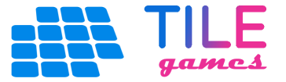
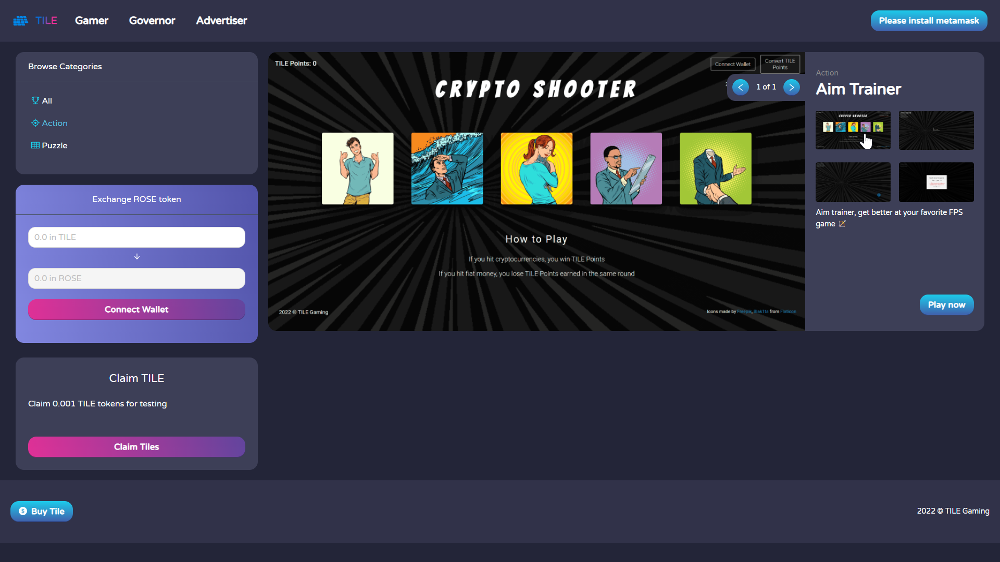
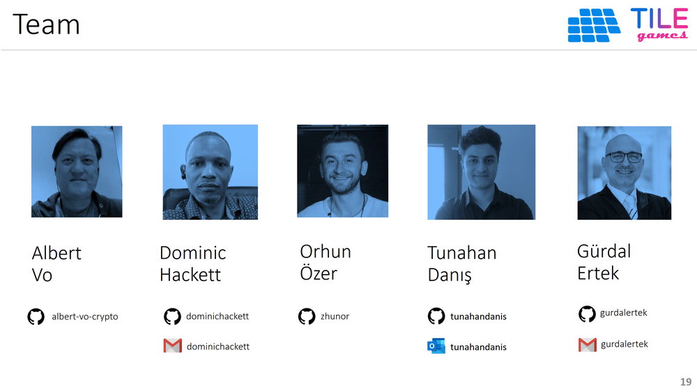

### TILE Games

P2E GameFi + Ad + DAO platform on Oasis, with built-in governance & monetization. Users play casual games to earn TILE crypto tokens. Funding for the distributed tokens inflows from ad revenues.

### START HERE:

- [**TILE Games Dapp**](https://tile-gaming.vercel.app/) is running live on the cloud.
- [**Documentation**](./doc/Documentation.md) describes the project and the dapp in detail.
- [**Slide Deck**](./doc/pdf/TILE_Games_v04g.pdf) describes the project.
- [**YouTube Video**](https://youtu.be/tPpiQSDGWNU) is the demo video for the hackathon.

### TILE Games Main Window

### Project Team

